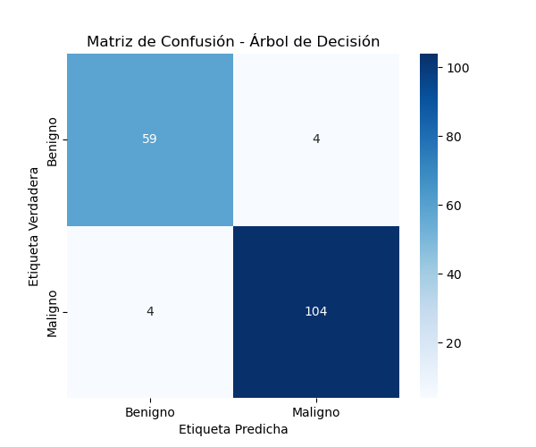
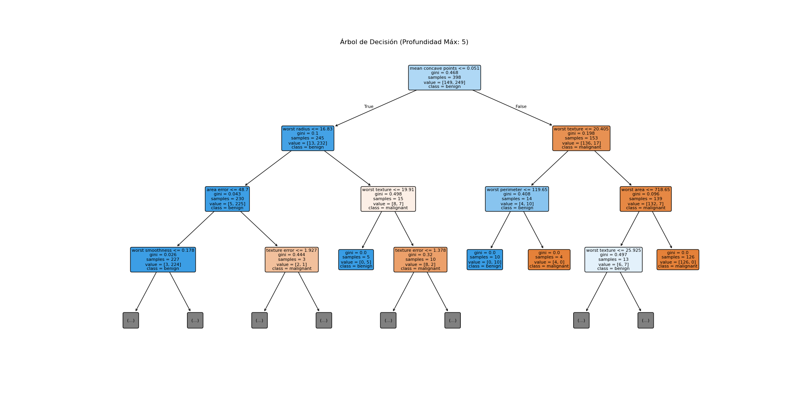
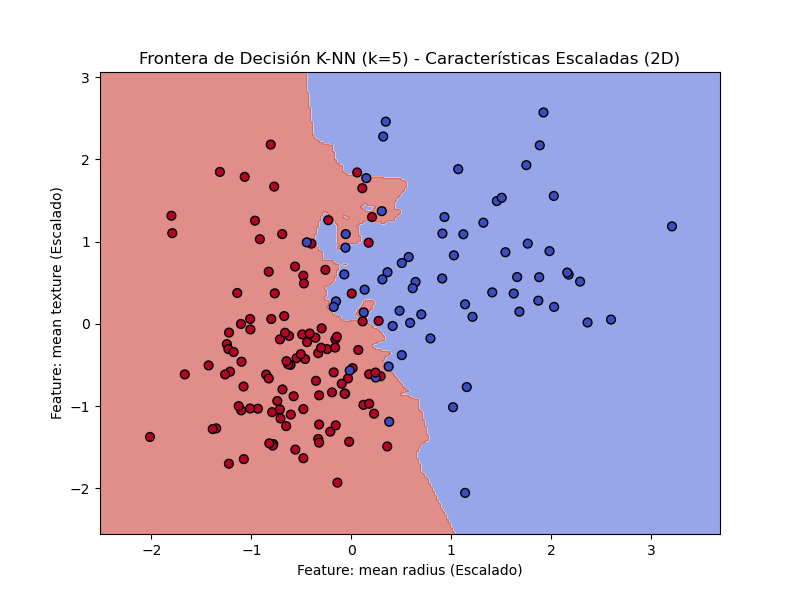

📄 Actividad - Clase 5: Comparación de Clasificadores (Árbol de Decisión vs. K-NN)

1. Introducción y contexto del problema

El objetivo de esta actividad es evaluar y comparar la precisión de dos algoritmos fundamentales de clasificación: el Árbol de Decisión (Decision Tree) y K-Vecinos Más Cercanos (K-NN).

Hemos utilizado el conjunto de datos de Cáncer de Mama de Wisconsin (load_breast_cancer) de la librería scikit-learn, un problema de clasificación binaria (Diagnóstico: Benigno o Maligno).

Metodología

   Datos: Dataset de Cáncer de Mama de Wisconsin (569 instancias, 30 características).

   División: 70% para entrenamiento, 30% para prueba.

   Preprocesamiento: Se aplicó escalado de características (StandardScaler) exclusivamente al modelo K-NN, ya que este algoritmo se basa en la distancia y es altamente sensible a la escala de las variables de entrada. El Árbol de Decisión utilizó los datos sin escalar.

   Parámetros:
        Árbol de Decisión: Profundidad Máxima (max_depth) = 5.
        K-NN: Número de Vecinos (n_neighbors) = 5.

2. Resultados Cuantitativos y Métricas

A continuación, se presenta la comparación de rendimiento en el conjunto de prueba, utilizando la Precisión y el Reporte de Clasificación (que incluye el Recall y el F1-Score) para una evaluación completa.

Comparación general de Precisión

| Algoritmo | Precisión (*Accuracy*) | Recall (Maligno - Clase 1) | F1-Score (Maligno - Clase 1) |
| :---: | :---: | :---: | :---: |
| **Árbol de Decisión** | [**_0.9532_**] | [**_0.96_**] | [**_0.96_**] |
| **K-NN (k=5)** | [**_0.96_**] | [**_0.97_**] | [**_0.97_**] |

(El F1-Score es la métrica más robusta en este caso, ya que equilibra la capacidad de detección con la predictividad.)

Matrices de Confusión

### Árbol de Decisión

### K-NN

3. Visualizaciones Clave

A. Visualización del Árbol de Decisión

El gráfico muestra las reglas aprendidas por el modelo. La ruta desde la raíz hasta una hoja representa la secuencia de decisiones tomadas para clasificar un tumor como Benigno o Maligno.

### Visualización del Árbol de Decisión

B. Frontera de Decisión de K-NN (2D Ilustrativo)

Este gráfico ilustra cómo K-NN divide el espacio de datos, basándose en la proximidad. La frontera es irregular y no lineal, reflejando que la clasificación es determinada por la mayoría de los 5 vecinos más cercanos.

Se utilizó una proyección 2D (con las primeras dos características escaladas) solo con fines ilustrativos, ya que el modelo real opera en 30 dimensiones.

### Frontera de Decisión

4. Análisis Comparativo

| Aspecto | Árbol de Decisión (DT) | K-NN (K=5) |
| :--- | :--- | :--- |
| **Requerimiento de Datos** | No afectado por el escalado de características. | **Depende totalmente del escalado** (necesita `StandardScaler`). |
| **Interpretabilidad** | **Alta ("Caja Blanca"):** Las reglas son visibles y fáciles de explicar (ej., umbrales). | **Baja ("Caja Negra"):** La clasificación se basa en la proximidad local; no hay reglas explícitas. |
| **Frontera de Decisión** | Genera fronteras **rectas** (umbrales) y perpendiculares. | Genera fronteras **irregulares y curvas**, adaptándose a la forma del vecindario. |
| **Velocidad de Predicción** | **Muy rápida** (solo sigue unas pocas ramas). | **Lenta** (debe calcular la distancia a todos los puntos de entrenamiento en tiempo de predicción). |

Análisis y conclusión final:

1. Evaluación Cuantitativa (F1-Score y Recall):

El modelo K-NN (0.96) obtuvo una precisión ligeramente superior al Árbol de Decisión (0.95). Sin embargo, en un problema médico, la métrica más crítica no es la precisión general, sino el Recall de la Clase Maligna (Clase 1), ya que busca minimizar los Falsos Negativos (no detectar un cáncer real).

Recall (Clase 1 - Maligno): K-NN obtuvo un Recall del 0.97 (97%), mientras que el Árbol de Decisión obtuvo un 0.96 (96%).

Conclusión de Métricas: K-NN demostró una capacidad de detección marginalmente superior para identificar correctamente los tumores malignos dentro de la muestra de prueba, lo que lo convierte en el modelo con mejor rendimiento puro.

2. La Métrica Crítica y el Impacto Clínico (Análisis de la matriz):

La ventaja de K-NN en el Recall (97% vs 96%) significa que, aunque la diferencia es pequeña, es más eficaz para evitar el error más costoso: un Falso Negativo. De 100 casos malignos, el K-NN predice 97 correctamente, dejando solo 3 Falsos Negativos, mientras que el Árbol de Decisión dejaría 4. En el diagnóstico de cáncer, la prioridad absoluta es la sensibilidad, lo que favorece a K-NN en términos de rendimiento puro.

3. Balance entre Rendimiento e Interpretabilidad (Recomendación Final):

A pesar de que K-NN ofrece el mejor rendimiento estadístico y es el modelo preferido si solo consideramos la tasa de error:

Recomendación: Para una implementación en un entorno real, el Árbol de Decisión es a menudo el modelo recomendado. Su principal fortaleza es la alta interpretabilidad. La capacidad de proporcionar reglas claras y lógicas para un diagnóstico ("Maligno porque el radio promedio es mayor a X") genera mayor confianza y es esencial para la validación clínica por parte de un médico.
